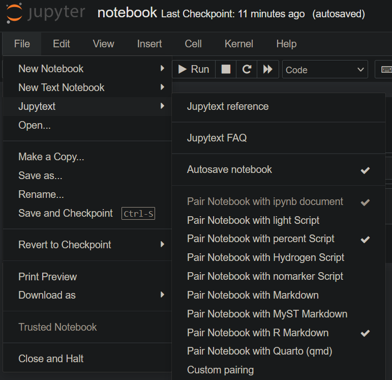

# GitHub and Kaggle Integration

## Use Case

## Design

![Design Diagram][Design Diagram]

## Usage

## Version Control

I prefer to use jupytext over nbconvert to handle
version control in jupyter notebooks.

### Using the native Jupyter Notebook interface

If using the default Jupyter notebook interface, you can
use Jupytext to pair your notebook with one or more scripts:

### Using VS Code for your notebook's interface

If you are using VS Code to do the programming in your notebook,
I am unaware of a stable extension that allows you to easily
connect Jupytext to your ipynb notebook. This means you must
manually convert your notebook using a tool like jupytext
or nbconvert if you want to avoid unnecessary diffs.

## Workflows

This repo can automatically push your notebook to Kaggle
in `.github/workflows/kaggle-ci.yml`

To do so, the workflow needs the following requirements:

* Kaggle username and Kaggle API key stored as GitHub secrets
* a .kaggleconfig file

[Design Diagram]: assets/kaggle-gh.drawio.svg
