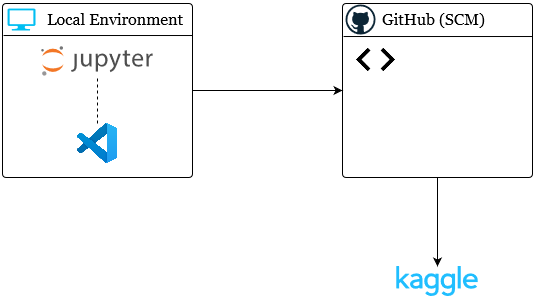
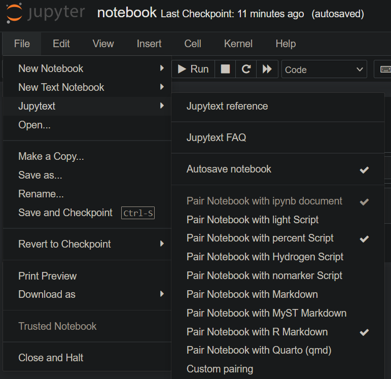

# GitHub and Kaggle Integration

Who is this project for? Any Kaggle users who would rather **host**
their notebooks in GitHub instead of directly in Kaggle.

## Use Case

The point of this workflow is to easily link your Kaggle notebooks
to GitHub. A few reasons why someone may want to do this are outlined below.

### Version Control

We all love source code management (SCM) and version control, right?
I find it to be just as useful for analytics work as it is for
software development.

Using version control on something like a Jupyter notebook, though, would
get quite messy since its basically just a JSON file. If we are trying to
use version control with our analytics project(s), we only really care
about the code we write in the cells which comprise a small percentage of
an `ipynb` file, unless you want to clear your output before every commit.

For these reasons I keep my notebooks in either an `.Rmd` file or a `.py`
script when using git. Jupyter has a tool ([nbconvert][nbconvert])
that aids in converting notebooks to and from other formats. There is
an alternative to nbconvert, which I prefer, called [Jupytext][Jupytext] that
this project utilizes.

## Design

The layout of this project is to allow you to do all of your notebook's
development locally. Once you're ready to publish your notebook, pushing
to GitHub will kick off a workflow that will publish (or update) your
work to Kaggle based on the information in `.kaggleconfig`.

## Usage

### Using the native Jupyter Notebook interface

If using the default Jupyter notebook interface, you can
use Jupytext to pair your notebook with one or more scripts:

### Using VS Code for your notebook's interface

If you are using VS Code to do the programming in your notebook,
I am unaware of a stable extension that allows you to easily
connect Jupytext to your ipynb notebook. This means you must
manually convert your notebook using a tool like jupytext
or nbconvert if you want to avoid unnecessary diffs.

## Workflows

This repo can automatically push your notebook to Kaggle
in `.github/workflows/kaggle-ci.yml`

To do so, the workflow needs the following requirements:

* Kaggle username and Kaggle API key stored as GitHub secrets
* a .kaggleconfig file

[nbconvert]: https://nbconvert.readthedocs.io/en/latest/
[Jupytext]: https://jupytext.readthedocs.io/en/latest/install.html
